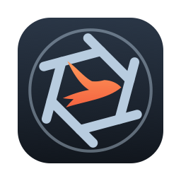

<p align="center"></p>
<h1 align="center">SwiftX</h1>
<h3 align="center">A native macOS screenshot, screen recording &amp; file-sharing tool</h3>
<br>
<div align="center">
  <a href="https://github.com/RetroHazard/SwiftX/actions/workflows/macos-swift.yml"></a>
  <a href="./LICENSE"></a>
  
  
</div>
<br>

SwiftX is a ground-up rewrite of [ShareX](https://github.com/ShareX/ShareX) as a native macOS app,
built entirely in Swift on top of ScreenCaptureKit, SwiftUI, and AppKit. It keeps the parts of
ShareX's workflow that make it worth using — instant region/window/screen capture, a full
annotation editor, dozens of upload destinations, a custom uploader engine, screen recording, and
scriptable automation — while adopting macOS-native APIs and conventions instead of emulating a
Windows app.

SwiftX is an independent project and is **not affiliated with or endorsed by the ShareX Team**.
Where code is directly ported from the original C# codebase, the upstream ShareX Team copyright is
preserved alongside the SwiftX copyright — see [License &amp; credits](#license--credits) below.

## Status

SwiftX is under active development. Most of the ShareX feature set already runs on macOS; see the
[feature parity tracker](docs/macos-swift-port/PARITY.md) for what's ported, partial, or still
planned. Releases are built, signed, and notarized by the
[release pipeline](.github/workflows/release.yml); until the first tagged release lands,
build from source (below).

## Features

- **Screen capture** — fullscreen, active window, monitor and window picker capture; a region
  overlay with rectangle/ellipse/freehand selection, window snapping, magnifier, fixed-size and
  snap-size modes, and cross-display stitching
- **Screen recording** — H.264/HEVC via ScreenCaptureKit + AVAssetWriter, GIF recording, optional
  WebM (VP9/VP8), animated WebP, and APNG output through a local ffmpeg install, pause/resume,
  system + microphone audio
- **Annotation editor** — shapes, text, step numbers, blur/pixelate/highlight regions, speech
  balloons, crop, smart eraser, magnify, spotlight, cut-out, undo/redo
- **Image effects** — 51 adjustments/filters/manipulations/drawings, `.sxie` preset import/export,
  and an image beautifier (padding, rounded corners, shadows, gradient backgrounds)
- **Uploads** — a multipart/JSON/XML upload core with progress and retry, the `.sxcu` custom
  uploader engine (and editor), OAuth2 with Keychain-backed tokens, Amazon S3, Backblaze B2, Azure
  Storage, ownCloud/Nextcloud, Seafile, keyless URL shorteners, and more
- **History &amp; main window** — a Windows-compatible SQLite history store (an existing
  `History.db` opens unchanged; `History.json`/`History.xml` import), searchable list and
  thumbnail grid, live upload queue, favorites and tag filters
- **Automation** — global hotkeys, watch folders, auto capture, scrolling capture, quick task menu,
  `swiftx://` URL scheme, CLI verbs, and a native messaging host for Chrome/Edge/Firefox
- **Tools** — color/screen color picker, ruler, OCR (Vision), QR generate/decode/scan, hash
  checker, metadata viewer/stripper, image and video converters, background remover, image
  comparer, folder indexer, and AI-assisted image analysis (OpenAI-compatible providers)

The full breakdown, including what's intentionally left out (Windows-only features, dead upstream
services) lives in [`docs/macos-swift-port/PARITY.md`](docs/macos-swift-port/PARITY.md).

## Requirements

- macOS 14 or later (Sonoma) — the ScreenCaptureKit APIs SwiftX builds on require it
- Swift 5.10+ / Xcode 15.4+ (a full Xcode install is needed to run the test suite; the Command Line
  Tools alone don't ship XCTest)
- [Homebrew](https://brew.sh) `ffmpeg` — optional, only used for encodes ScreenCaptureKit's
  VideoToolbox path can't produce (WebM, animated WebP, APNG)

## Building from source

SwiftX is a plain Swift Package — there's no Xcode project to open.

```sh
git clone https://github.com/RetroHazard/SwiftX.git
cd SwiftX

swift build               # debug build
swift test                # requires a full Xcode install; see docs/DEVELOPMENT.md
./Scripts/make-app.sh     # bundles build/SwiftX.app and installs it to /Applications
open /Applications/SwiftX.app
```

Always launch SwiftX through the *installed* `.app` bundle (`open /Applications/SwiftX.app`), not
the raw binary and not `build/SwiftX.app` directly — macOS ties Screen Recording/Accessibility
permission grants to the bundle's path and signature, a bare terminal launch never gets its own
prompt, and the `build/` path stays pinned to a stale pre-rename bundle identity that never gets
its own permission prompts either. See
[`docs/DEVELOPMENT.md`](docs/DEVELOPMENT.md) for the full developer workflow, and
[`docs/solutions/patterns/critical-patterns.md`](docs/solutions/patterns/critical-patterns.md) for
this and other gotchas discovered while porting.

## Project layout

| Module | Covers |
|---|---|
| `SharedKit` | Settings engine, name parser, shared helpers |
| `CaptureKit` | Screen/window/region capture, recording |
| `UploadKit` | Upload core, custom uploader engine, OAuth2 |
| `EditorKit` | Annotation editor |
| `EffectsKit` | Image effects and beautifier |
| `HistoryKit` | SQLite history store |
| `ToolsKit` | Color picker, ruler, OCR/QR, hash checker, converters, indexer |
| `SwiftXApp` | The app itself — menu bar shell, settings, CLI |
| `NativeMessagingHost` | `swiftx-host` — browser native messaging binary |

Each `*Kit` module has a matching test target under `Tests/`; `SwiftXApp` and
`NativeMessagingHost` are the two executable targets.

## Documentation

- [`docs/macos-swift-port/PARITY.md`](docs/macos-swift-port/PARITY.md) — feature-by-feature parity
  status against upstream ShareX
- [`docs/macos-swift-port/SECURITY-MODEL.md`](docs/macos-swift-port/SECURITY-MODEL.md) — trust
  boundaries, credential storage, and the (deliberate) no-App-Sandbox posture
- [`docs/solutions/`](docs/solutions/) — a running log of non-obvious patterns, gotchas, and fixes
  found while building SwiftX (TCC permissions, SPM app-bundle packaging, `swift test` setup, etc.)

## Contributing

See [`CONTRIBUTING.md`](CONTRIBUTING.md) for the development workflow, coding conventions
(including the two-tier copyright header used on ported files), and how to submit changes.

## License &amp; credits

SwiftX is free software, licensed under the [GNU GPL v3](./LICENSE).

- macOS port and all original code: © 2026 [RetroHazard](https://github.com/RetroHazard)
- Files ported or translated from the original codebase carry a preserved
  `Copyright (c) 2007-2026 ShareX Team` notice alongside the SwiftX copyright, per GPLv3 §5(d)
- Based on [ShareX](https://github.com/ShareX/ShareX) — SwiftX is an independent project and is not
  affiliated with or endorsed by the ShareX Team

Found a security issue? See [`SECURITY.md`](.github/SECURITY.md).
